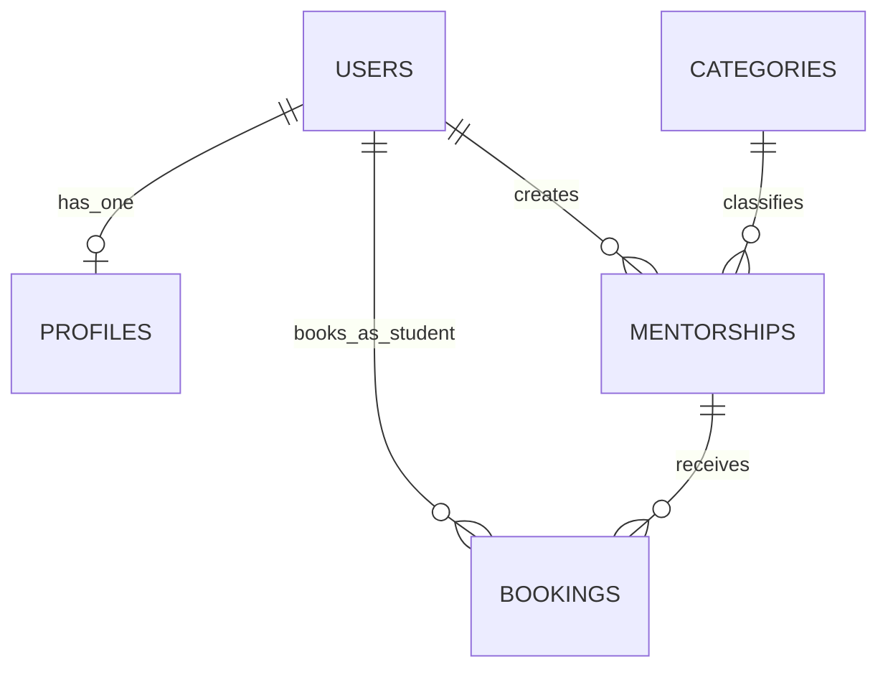

# Mentorships API

Production-oriented REST backend for a mentorship platform, designed to be secure, modular, and ready for real-world scaling. It delivers JWT-based authentication, profile management, and a relational data model covering users, mentorships, categories, and bookings.
The codebase follows Clean Code and layered architecture principles (routes/controllers/services/repositories), improving maintainability, testability, and long-term extensibility.

## Technologies
### Backend
- Node.js + TypeScript
- Express 5 (HTTP API)
- PostgreSQL + Drizzle ORM + Drizzle Kit
- Zod (request and environment validation)
- JOSE (JWT) + bcrypt (password hashing)
- Helmet + CORS
- Vitest (testing)

### Frontend (recommended client stack)
- React
- Tailwind CSS
- React Router

## App architecture
- `src/server.ts`: global middleware, route mounting, and error handling.
- `src/modules/auth`: register/login flows and JWT token generation.
- `src/modules/users`: authenticated profile read/update (`/users/me`).
- `src/db`: DB connection, schema, relations, and repositories.
- `src/middleware`: JWT auth, Zod validation, async handler, and standardized responses.

## Main endpoints
- `GET /health`
- `POST /auth/register`
- `POST /auth/login`
- `GET /users/me` (requires `Authorization: Bearer <token>`)
- `PATCH /users/me` (requires token)

## Entities and relationships (UML/ER)

### Domain model explained
- `USERS`: central identity entity. Each user has authentication fields (`email`, `password_hash`) and a business role (`mentor`, `student`, `admin`).
- `PROFILES`: optional one-to-one extension of a user (`bio`, `linkedin_url`, `avatar_url`), separated from auth data to keep responsibilities clear.
- `CATEGORIES`: taxonomy for mentorship topics (for example, software, math, physics); one category can group many mentorship offers.
- `MENTORSHIPS`: offer published by a mentor user, linked to one category, with pricing and scheduling capacity (`price`, `slots`, `duration`).
- `BOOKINGS`: reservation made by a student for a specific mentorship session, including lifecycle status (`pending`, `confirmed`, `cancelled`) and `scheduled_at`.

## Environment variables
- `NODE_ENV`, `PORT`, `DATABASE_URL`
- `JWT_SECRET`, `JWT_EXPIRES_IN`
- `ALLOWED_ORIGINS`, `BCRYPT_SALT_ROUNDS`

## Quick start
1. `npm install`
2. `npm run db:docker:up`
3. `npm run db:migrate && npm run db:seed`
4. `npm run dev`